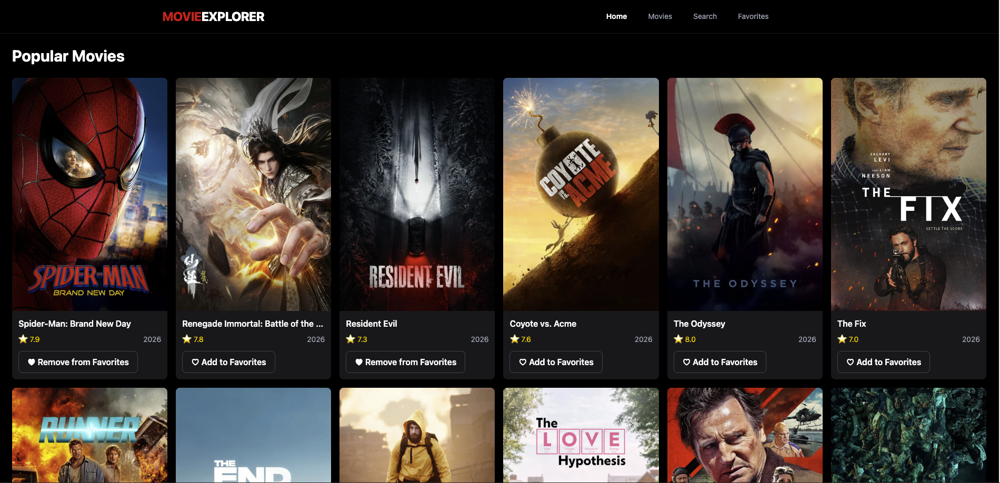
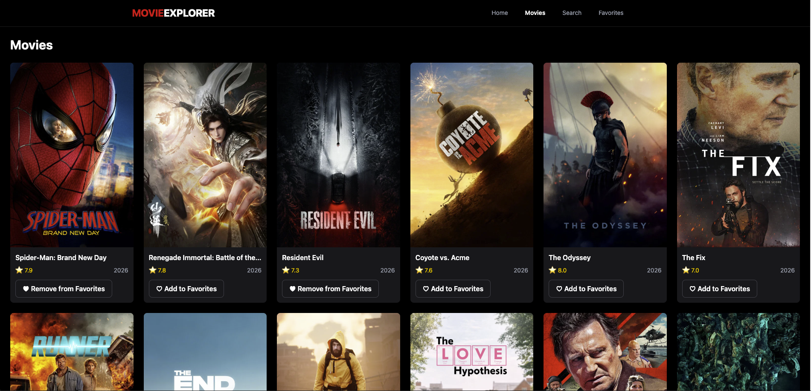
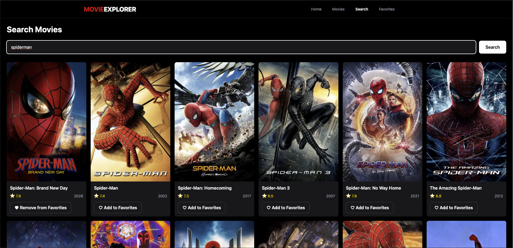
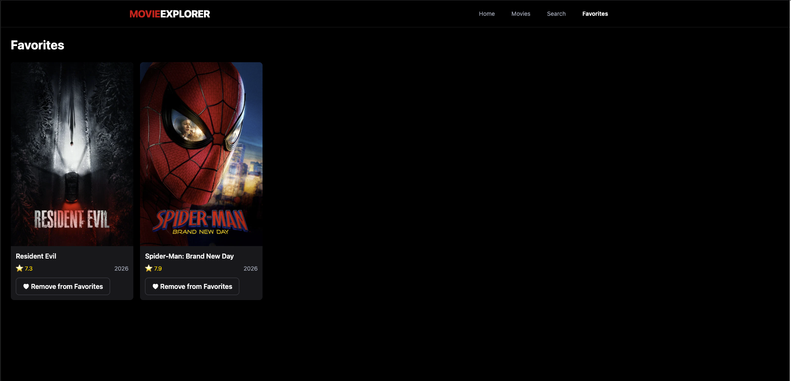

# 🎬 Movie Explorer

A modern movie discovery web application built with React, TypeScript, Tailwind CSS, and the TMDB API.

Movie Explorer allows users to discover movies, search for specific titles, view detailed movie information, and save their favorite movies using browser localStorage.

## 🚀 Live Demo

🔗 **Live Demo:https://harsha-dev-01-coder.github.io/movie-explorer/

## 📸 Screenshots

### Home



### Movie Details



### Search



### Favorites



> Screenshots will be added before deployment.

---

## ✨ Features

### 🎬 Movie Discovery

- Popular Movies
- Top Rated Movies
- Now Playing Movies
- Responsive movie grid
- Movie posters
- Ratings
- Release years

### 🔎 Movie Search

- Search movies using TMDB
- Search results
- URL-based search queries
- Search synchronization with URL parameters
- Example:
  `/search?query=batman`

### 🎥 Movie Details

Each movie has a dedicated details page containing:

- Movie poster
- Backdrop image
- Title
- Tagline
- Rating
- Release date
- Release year
- Genres
- Overview
- Runtime

### ❤️ Favorites

- Add movies to favorites
- Remove movies from favorites
- Favorites persist after refreshing the page
- Favorites stored using browser localStorage
- Favorite button available on movie cards and details pages
- Dedicated Favorites page
- Empty favorites state

### 📱 Responsive UI

The application is designed for:

- Mobile
- Tablet
- Laptop
- Desktop
- Large desktop screens

### ⚡ User Experience

- Loading states
- Error states
- Empty states
- Invalid movie handling
- Hover states
- Focus states
- Responsive navigation
- Consistent UI

---

## 🛠️ Tech Stack

### Frontend

- React
- TypeScript
- Vite
- Tailwind CSS

### Routing

- React Router

### API

- TMDB REST API
- Axios

### State & Storage

- React Hooks
- Browser localStorage

### Development Tools

- Oxlint
- TypeScript
- Git
- GitHub
- Vite

---

## 📁 Project Structure

```text
src/
│
├── components/
│   ├── EmptyState.tsx
│   ├── ErrorMessage.tsx
│   ├── FavoriteButton.tsx
│   ├── Loading.tsx
│   ├── MovieCard.tsx
│   ├── MovieGrid.tsx
│   └── Navbar.tsx
│
├── pages/
│   ├── Favorites.tsx
│   ├── Home.tsx
│   ├── MovieDetails.tsx
│   ├── Movies.tsx
│   └── Search.tsx
│
├── services/
│   ├── api.ts
│   └── movieService.ts
│
├── types/
│   └── movie.ts
│
├── utils/
│   ├── favorites.ts
│   ├── format.ts
│   └── image.ts
│
├── App.tsx
├── index.css
└── main.tsx


🔄 Application Data Flow

TMDB API
   ↓
Axios
   ↓
movieService.ts
   ↓
React Pages
   ↓
Reusable Components
   ↓
MovieCard / MovieGrid


Favorites Flow:

Movie
   ↓
FavoriteButton
   ↓
favorites.ts
   ↓
localStorage
   ↓
Favorites Page
   ↓
MovieGrid
   ↓
MovieCard


⚙️ Installation

Clone the repository:


git clone https://github.com/Harsha-Dev-01-coder/movie-explorer

Navigate into the project:

cd movie-explorer


Install dependencies:

npm install


Create your environment file:

cp .env.example .env


Add your TMDB API key to .env:


▶️ Run Locally

Start the development server:

npm run dev


The application will be available at:

http://localhost:5173


🏗️ Production Build

Create a production build:

npm run build


Preview the production build locally:

npm run preview


🧪 Code Quality

Run the linter:

npm run lint


Run the production build:

npm run build

The project uses TypeScript for static type checking and Oxlint for code-quality checks.


🧭 Main Routes

Route	Description
/	Home page
/movies	Movie discovery
/movies/:id	Movie details
/search	Movie search
/favorites	Saved favorite movies


❤️ Favorite Storage

Favorites are stored locally in the user’s browser using:

localStorage

Favorites remain available after refreshing the page on the same browser.

No user account or external database is required for the favorites feature.


🌐 Deployment

The application can be deployed using services such as:

* Vercel
* Netlify
* Cloudflare Pages

Before deployment, configure the environment variable:


🔐 Security
* API credentials are stored in environment variables.
* .env is excluded from Git.
* No API key is hardcoded into the source code.
* .env.example contains only the variable name and no secret value.


📚 What I Learned

This project helped me practice:

* React component architecture
* TypeScript interfaces and type safety
* React Router
* Dynamic routes
* URL search parameters
* REST APIs
* Axios
* Async/await
* Loading and error handling
* Reusable components
* Utility functions
* localStorage
* Responsive Tailwind CSS
* Git and GitHub
* Environment variables
* Production builds
* Deployment


🎯 Future Improvements

Possible future improvements include:

* Pagination
* Movie genre filtering
* Advanced search filters
* Actor and cast information
* Watchlist
* User authentication
* Movie trailers
* Recommendations
* Server-side data caching


👨‍💻 Author

Harsha

Frontend Developer in progress 🚀

Built with React, TypeScript, Tailwind CSS, and a lot of debugging.


📄 License

This project is for educational and portfolio purposes.

Movie data and images are provided by TMDB.

This project is not affiliated with or endorsed by TMDB.
